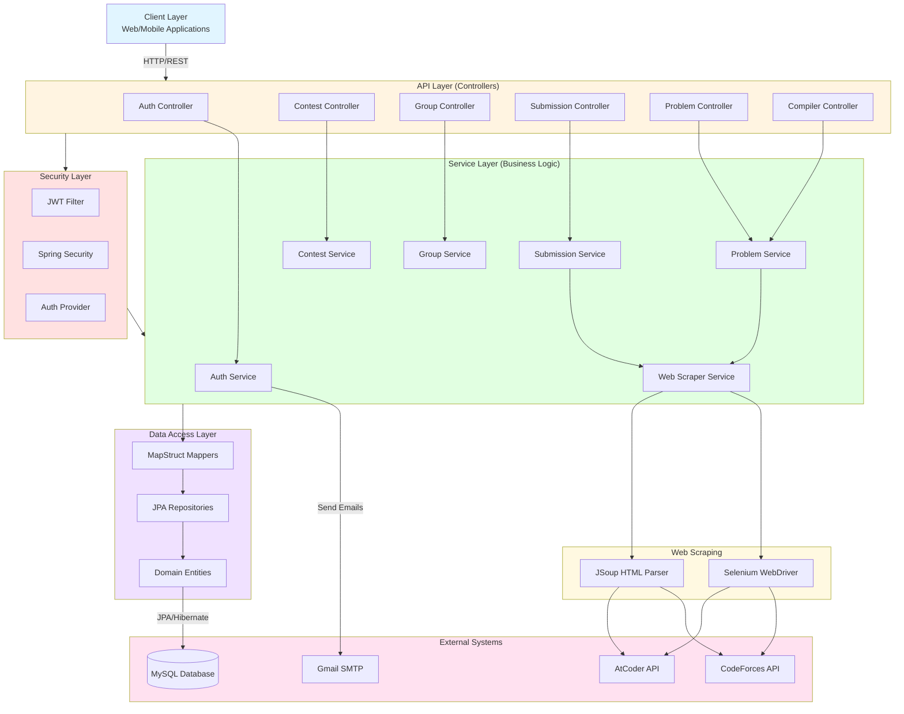

# X-Judge

A unified online judge platform that aggregates problems from multiple competitive programming platforms (CodeForces, AtCoder) with user management, contests, groups, and submission tracking.

## 🚀 Features

- **Multi-Platform Problem Aggregation**: Fetch and solve problems from CodeForces and AtCoder
- **User Management**: Registration, authentication, email verification, password reset
- **Contest System**: Create and participate in programming contests
- **Group Management**: Create private/public groups for collaborative learning
- **Submission Tracking**: Submit solutions and track submission status across platforms
- **JWT Authentication**: Secure API endpoints with JWT-based authentication
- **Email Notifications**: Automated email system for user verification and notifications
- **RESTful API**: Well-documented API with Swagger/OpenAPI integration

## 📋 Prerequisites

- **Java 21** or higher
- **MySQL 8.0+**
- **Maven 3.6+**
- **Firefox Browser** (for Selenium web scraping)
- **Gmail Account** (for SMTP email service)

## 🛠️ Installation & Setup

### 1. Clone the Repository
```bash
git clone https://github.com/Zeyad2003/X-Judge.git
cd X-Judge
```

### 2. Database Setup
Create a MySQL database:
```sql
CREATE DATABASE `X-Judge`;
```

### 3. Configure Environment Variables
Create an `env.properties` file in `src/main/resources/`:

```properties
# Database Configuration
DB_USERNAME=your_mysql_username
DB_PASSWORD=your_mysql_password

# Email Configuration (Gmail)
MAIL_USERNAME=your_email@gmail.com
MAIL_PASSWORD=your_app_password

# Online Judge Credentials (2 accounts for each platform)
CODEFORCES_USERNAME1=your_codeforces_username1
CODEFORCES_PASSWORD1=your_codeforces_password1
CODEFORCES_USERNAME2=your_codeforces_username2
CODEFORCES_PASSWORD2=your_codeforces_password2

ATCODER_USERNAME1=your_atcoder_username1
ATCODER_PASSWORD1=your_atcoder_password1
ATCODER_USERNAME2=your_atcoder_username2
ATCODER_PASSWORD2=your_atcoder_password2

# JWT Security
SECRET_KEY=your_secure_secret_key_here

# Browser Configuration (Firefox)
BROWSER_PATH=/path/to/firefox/binary
BROWSER_VERSION=your_firefox_version
```

### 4. Build and Run

Using Maven Wrapper:
```bash
# Linux/Mac
./mvnw clean install
./mvnw spring-boot:run

# Windows
mvnw.cmd clean install
mvnw.cmd spring-boot:run
```

The application will start on `http://localhost:7070`

### 5. Default Admin Account
After first run, a default admin account is created:
- **Username**: `xjudge`
- **Password**: `xjudge`
- **Email**: `xjudge@gmail.com`

## 📚 API Documentation

Once the application is running, access the Swagger UI documentation at:
```
http://localhost:7070/swagger-ui.html
```

## 🏗️ Architecture




## 📦 Tech Stack

- **Framework**: Spring Boot 3.2.2
- **Language**: Java 21
- **Database**: MySQL 8.0.33
- **ORM**: Spring Data JPA / Hibernate
- **Security**: Spring Security + JWT
- **Documentation**: SpringDoc OpenAPI 3
- **Email**: Spring Mail (Gmail SMTP)
- **Web Scraping**: Selenium 4.17.0 + JSoup 1.15.3
- **Mapping**: MapStruct 1.5.5
- **Template Engine**: Thymeleaf
- **Build Tool**: Maven

## 📁 Project Structure

```
X-Judge/
├── src/main/java/com/xjudge/
│   ├── config/          # Security & application configuration
│   ├── controller/      # REST API controllers
│   ├── entity/          # JPA entities
│   ├── exception/       # Custom exception handlers
│   ├── mapper/          # MapStruct mappers
│   ├── model/           # DTOs and request/response models
│   ├── repository/      # JPA repositories
│   ├── service/         # Business logic services
│   └── util/            # Utility classes
├── src/main/resources/
│   ├── application.properties
│   └── env.properties   # Environment variables (create this)
└── pom.xml
```

## 🤝 Contributing

Contributions are welcome! Please feel free to submit a Pull Request.

---

**Note**: This is the master branch. A rebuild is in progress on the `project-rebuild` branch with enhanced features and improvements.
